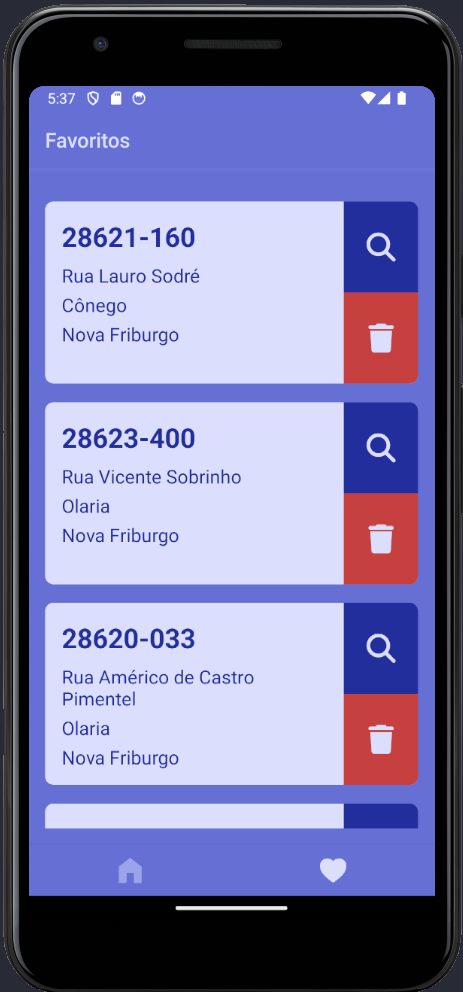

# Qual CEP? - Aplicativo React Native

## Descrição

O aplicativo "Qual CEP?" foi desenvolvido utilizando o React Native CLI e oferece uma solução intuitiva para encontrar CEPs a partir de informações de estado, cidade e endereço fornecidas pelo usuário. Além disso, o aplicativo permite que o usuário salve CEPs relevantes para consulta futura, com a opção de excluí-los posteriormente. A integração com o mapa também está disponível para visualizar a localização associada a um CEP específico.

## Funcionalidades

- Busca de CEP a partir de informações de estado, cidade e endereço.
- Salvamento e exclusão de CEPs relevantes.
- Integração com o mapa para visualização da localização associada a um CEP.

## Tecnologias Utilizadas

- **React Native CLI**: Plataforma de desenvolvimento para criar aplicativos móveis usando React.
- **Axios**: Biblioteca para controlar requisições à API de busca de CEP.
- **AsyncStorage**: Módulo para armazenar de forma assíncrona dados locais, utilizado para salvar CEPs de interesse.
- **React Navigation**: Biblioteca para facilitar a navegação entre as páginas do aplicativo.
- **TypeScript**: Superset do JavaScript que adiciona tipagem estática ao código, melhorando a manutenibilidade e escalabilidade do projeto.

## Capturas de Tela

Inseriremos algumas capturas de tela para ilustrar as principais telas e funcionalidades do aplicativo.

_Descrição da imagem: Tela inicial onde o usuário insere as informações de estado, cidade e endereço._

_Descrição da imagem: Resultado da busca exibindo o CEP correspondente às informações fornecidas._

_Descrição da imagem: Detalhes do CEP correspondente às informações fornecidas._

_Descrição da imagem: Lista de CEPs salvos pelo usuário, com a opção de excluí-los._

## Como Executar o Projeto

1. Clone o repositório: `git clone https://github.com/jvg87/qualCep.git`
2. Instale as dependências: `npm install` ou `yarn install`
3. Execute o aplicativo: `npx react-native run-android` ou `npx react-native run-ios`

Certifique-se de ter o ambiente de desenvolvimento configurado para o React Native antes de executar os passos acima.

## Contribuições

Contribuições são bem-vindas! Sinta-se à vontade para abrir issues ou pull requests para melhorar o aplicativo.

## Licença

Este projeto está licenciado sob a [MIT License](LICENSE).
